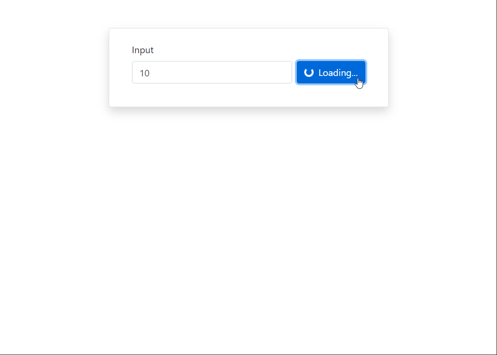
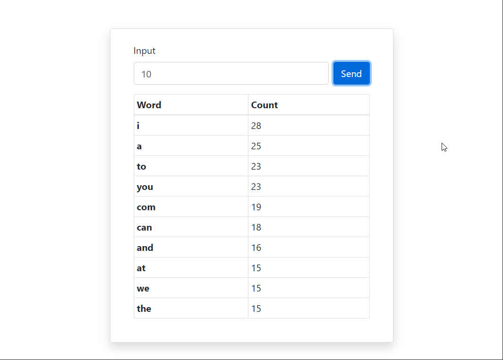

# React WordFreq

Display's the top N words and their frequency of occurrence  

> **Note:**  
> Please be patient, the website can take time to load  
> As the traffic is low it may go to **dyno sleep**  

## Process

- An Input field which accepts a number  
    
- When no value is passed in input field  
      
- On Send button pressed, a request is made to [backend](https://github.com/SutharMukesh/ttt-wordfreq-api)  
      
- If any Error occured on backend  
      
- Backend returns a list of top n words and their respective count which are displayed in a tabular format  
    

## Components

1. **input**
   - Takes input value
   - **Send button** which sends request to backend.
2. **output**
   - Display response data in **table**
